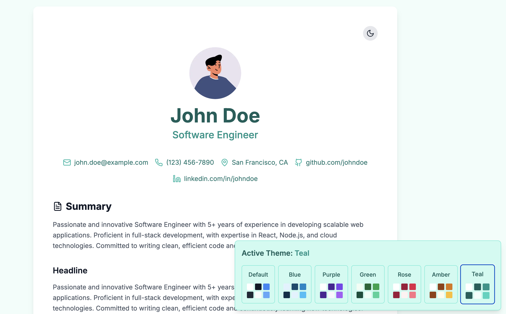

# MarkdownResume

MarkdownResume is a modern, hassle-free solution for creating your professional online resume. Simply write your content in Markdown format, and the project will generate a beautifully designed, responsive website with built-in dark/light mode support, multiple color themes, and sharing capabilities.


## Features

- 🎨 **Multiple Theme Options**: Choose from 7 pre-built color themes (Default, Blue, Purple, Green, Rose, Amber, Teal)
- 🌗 **Dark/Light Mode**: Automatic theme switching with system preferences support
- 📱 **Fully Responsive**: Optimized for mobile, tablet, and desktop viewing
- 📝 **Markdown-Based**: All content is managed through simple Markdown files
- 🎯 **SEO Ready**: Built-in metadata management for better search engine visibility
- 📄 **Legal Compliance**: Integrated support for Legal Notice and Data Privacy Policy pages
- 🔗 **Share Options**: Comprehensive sharing functionality with link, QR code, email, and vCard options
- 🌐 **Configurable Text**: All website text can be easily customized through configuration settings, perfect for translations

## Content Structure

The resume content is organized in the `content/` directory with the following structure:

```
content/
├── personal-details.md    # Basic information and contact details
├── summary.md            # Professional summary/overview
├── skills.md            # Technical and professional skills
├── experience/          # Work experience entries
│   ├── 001-current-job.md
│   └── 002-previous-job.md
├── education/          # Educational background
│   └── 001-bachelor-computer-science.md
├── publications/       # Academic or professional publications
│   ├── 001-latest-paper.md
│   └── 002-conference-paper.md
├── achievements/       # Professional achievements and awards
│   ├── 001-latest-award.md
│   └── 002-previous-award.md
├── legalnotice.md     # Optional legal notice page
└── dataprivacypolicy.md # Optional data privacy policy page
```

## Setup Guide

### 1. Installation

#### Prerequisites
- Node.js 18.x or higher
- npm 9.x or higher
- Git

#### Basic Setup

```bash
# Fork the repository
# Visit https://github.com/seeschweiler/MarkdownResume
# Click the 'Fork' button in the top right
# Follow the instructions to create a fork in your account

# Clone your forked repository
git clone https://github.com/YOUR-USERNAME/MarkdownResume
cd markdown-resume

# Install dependencies using npm
npm install

# Create required environment file
echo "NEXT_PUBLIC_BASE_URL=http://localhost:3000" > .env.local
```

#### Required Directory Structure

Create the following files in your content directory:

```
content/
├── personal-details.md    # Required: Basic information
├── summary.md             # Required: Professional summary
├── skills.md            # Required: Technical skills
├── experience/          # Required: Work experience entries
│   ├── 001-current-job.md
│   └── 002-previous-job.md
├── education/           # Required: Educational background
│   └── 001-bachelor-computer-science.md
├── publications/        # Required: Academic or professional publications
│   ├── 001-latest-paper.md
│   └── 002-conference-paper.md
├── achievements/        # Required: Professional achievements and awards
│   ├── 001-latest-award.md
│   └── 002-previous-award.md
├── legalnotice.md       # Optional: Legal notice
└── dataprivacypolicy.md # Optional: Privacy policy
```

#### Development Mode

```bash
# Start the development server with Turbopack
npm run dev
```
Visit `http://localhost:3000` to see your resume.

#### Production Build

```bash
# Create production build
npm run build

# Start production server
npm start
```

### 2. Content Configuration

All content is managed through markdown files in the `content` directory. Each section of your resume is represented by specific markdown files with YAML frontmatter.

#### Personal Details (personal-details.md)

The `personal-details.md` file in the `content/` directory contains your personal information and contact details. This file is used to display your name, professional title, contact information, location, and social media links.

```markdown
---
name: "Your Name"
role: "Your Professional Title"
contact:
  email: "your.email@example.com"
  phone: "123-456-7890"
location: "City, Country"
social:
  github: "github.com/username"
  linkedin: "linkedin.com/in/username"
avatar: "/profile_avatar.png"  # Used for profile display and vCard contact photo
---
```

#### Experience Entries (experience/*.md)

Experience entries are stored in markdown files within the `content/experience` directory. Each file represents a single work experience, such as a job, internship, or freelance project. The files should follow the naming convention `[order]-[description].md`, where `order` helps maintain the desired display sequence.

The experience entries are displayed in chronological order, with the most recent experience appearing first. The content section supports markdown formatting, allowing you to include lists, links, and other formatted text.

Example: `content/experience/001-current-job.md`:
```markdown
---
title: "Senior Software Engineer"
company: "Company Name"
startDate: "2023-01"  # YYYY-MM format
endDate: "Present"    # or YYYY-MM format
---

- Key responsibility
- Major achievement
- Notable project
```

#### Education Entries (education/*.md)

Education entries are stored in markdown files within the `content/education` directory. Each file represents a single educational milestone, such as a degree, certification, or training program. The files should follow the naming convention `[order]-[description].md`, where `order` helps maintain the desired display sequence.

The education entries are displayed in chronological order, with the most recent education appearing first. The content section supports markdown formatting, allowing you to include lists, links, and other formatted text.

Example: `content/education/001-bachelor-computer-science.md`:
```markdown
---
title: "Bachelor of Science in Computer Science"
institution: "University Name"
startDate: "2019-09"  # YYYY-MM format
endDate: "2023-06"    # YYYY-MM format or "Present"
---

Details about your education, such as:
- Major areas of study
- Notable achievements
- Relevant coursework
- Academic honors or awards
- Special projects or research
```

#### Skills (skills.md)

The `skills.md` file in the `content/` directory allows you to organize your skills into logical categories (e.g., Programming Languages, Frontend Development, Languages, etc.). Each category can contain multiple skills, providing a clear structure to your skillset.

Example `content/skills.md`:
```markdown
---
skillCategories:
  - category: Programming Languages
    skills:
      - TypeScript
      - JavaScript
      - SQL
  - category: Frontend Development
    skills:
      - React
      - HTML/CSS
  - category: Backend Development
    skills:
      - Node.js
      - Express
      - MongoDB
  - category: DevOps & Tools
    skills:
      - AWS
      - Docker
      - Git
---
```

The skills can be displayed in two different modes:

1. **Categorized Display** (default): Skills are grouped and displayed under their respective category headings.

*Skills displayed with categories enabled*

2. **Flat List Display**: All skills are shown in a single list without category headers.

*Skills displayed without categories*

You can switch between these display modes by configuring the `displaySkillCategories` setting in `site.config.ts`:
```typescript
const siteConfig = {
  displaySkillCategories: true,  // Set to false for flat list display
  // ... other config options
};
```

#### Publications (publications/*.md)

Publications are stored in markdown files within the `content/publications` directory. Each file represents a single publication, such as a paper, article, or other written work. The files should follow the naming convention `[order]-[description].md`, where `order` helps maintain the desired display sequence.

Example: `content/publications/001-latest-paper.md`:
```markdown
---
title: "Your Publication Title"
authors: "Your Name, Co-Author Name"
venue: "Journal or Conference Name"
date: "2023-12"    # YYYY-MM format
---

Description of the publication, key findings, or abstract. You can include:
- Research objectives
- Methodology highlights
- Key findings
- Impact or citations
- Links to full paper or DOI
```

The publications will be displayed in chronological order, with the most recent publications appearing first. All frontmatter fields (authors, venue, date) are optional - if a field is omitted, it will be skipped in the display without showing empty separators.

#### Achievement Entries (achievements/*.md)

Achievement entries are stored in markdown files within the `content/achievements` directory. Each file represents a significant professional accomplishment, award, or recognition. The files should follow the naming convention `[order]-[description].md`, where `order` helps maintain the desired display sequence.

The achievements are displayed in chronological order, with the most recent achievements appearing first. Each achievement entry requires specific frontmatter fields to properly display in the timeline.

Example: `content/achievements/001-tech-innovation.md`:
```markdown
---
year: "2023"           # Year of achievement
title: "Tech Innovation Award"  # Name of award or achievement
description: "Recognized for developing a groundbreaking AI-powered code review system."  # Brief description of the achievement
---
```

The achievements section provides a timeline view of your professional accomplishments, making it easy for readers to track your career milestones. Each achievement is displayed with:
- A year indicator
- The achievement title
- A concise description of the accomplishment or recognition

### 3. Theme Configuration

The application comes with a built-in theme system that offers multiple color schemes and a theme selector component.

#### Available Themes

The following themes are available out of the box:

1. **Default**: A clean, professional color scheme with subtle teal accents
2. **Blue**: Modern blue tones for a trustworthy, corporate feel
3. **Purple**: Rich purple hues for a creative, innovative appearance
4. **Green**: Fresh green tones emphasizing growth and sustainability
5. **Rose**: Warm rose colors for a friendly, approachable style
6. **Amber**: Vibrant amber shades for an energetic, dynamic look
7. **Teal**: Deep teal tones for a sophisticated, technical impression

Each theme includes carefully selected color combinations for:
- Primary and secondary backgrounds
- Text colors (primary, secondary, accent)
- Interactive elements
- Footer sections

#### Theme Configuration

Edit `config/site.config.ts` to configure your theme preferences:

```typescript
const siteConfig = {
  // Theme and display settings
  activeTheme: "default", // Choose from: "default", "blue", "purple", "green", "rose", "amber", "teal"
  displayThemeSelector: true, // Enable/disable theme selector in UI
  // ... other config options
};
```

#### Theme Selector

When `displayThemeSelector` is enabled, a theme selection component will appear in the UI, allowing users to switch between different themes in real-time:



The theme selector provides:
- Visual preview of each theme's colors
- Active theme indication
- Smooth transition animations between themes
- Persistent theme selection (saved in browser)

All themes are designed to work seamlessly with both light and dark modes, ensuring a consistent and professional appearance across all color schemes and viewing preferences.

### 4. Share Dialog Configuration

The application includes a comprehensive sharing system that allows visitors to easily share the resume through various methods.


#### Share Dialog Features

The share dialog provides four sharing methods that can be individually enabled or disabled through the configuration:

1. **Link Sharing**:
   - Displays the current URL
   - One-click copy to clipboard
   - Enable/disable via `displayShareDialogTabLink`

2. **QR Code**:
   - Generates a QR code for the current URL
   - Perfect for mobile access
   - Enable/disable via `displayShareDialogTabQRCode`

3. **Email Sharing**:
   - Opens default email client
   - Customizable subject and body text
   - Enable/disable via `displayShareDialogTabEmail`

4. **Contact (vCard Download)**:
   - Download contact information as virtual business card
   - Compatible with contact management applications
   - Enable/disable via `displayShareDialogTabContact`

Configure the share dialog in `site.config.ts`:

The share dialog configuration allows you to customize:

- `displayShareDialog`: Master toggle to show/hide the entire share functionality
- `displayShareDialogTabLink`: Toggle the URL sharing tab
- `displayShareDialogTabEmail`: Toggle the email sharing tab  
- `displayShareDialogTabQRCode`: Toggle the QR code sharing tab
- `displayShareDialogTabContact`: Toggle the vCard contact download tab

The dialog text content can be customized through `texts.shareDialog`:

- `headline`: The dialog title
- `email.subject`: Default subject line for email sharing
- `email.body`: Default email body text
- `tabs`: Description text for each sharing method tab

Here is an example of how to configure the share dialog:

```typescript
const siteConfig: SiteConfig = {
  // Main share dialog toggle
  displayShareDialog: true,
  
  // Individual feature toggles
  displayShareDialogTabLink: true,
  displayShareDialogTabEmail: true,
  displayShareDialogTabQRCode: true,
  displayShareDialogTabContact: true,

  texts: {
    shareDialog: {
      headline: "Share Resume",
      email: {
        subject: "Check out this resume",
        body: "I thought you might be interested in this resume:"
      },
      tabs: {
        link: "Copy the direct link to share this resume with others",
        qrCode: "Scan or copy the QR code to open this resume on a mobile device",
        email: "Send this resume directly via email",
        contact: "Download contact information as a virtual business card (vCard)"
      }
    }
  }
};
```

All dialog texts can be customized through the `texts.shareDialog` configuration object.

### 5. SEO Configuration

The `site.config.ts` file provides SEO customization through the `texts.metadata` configuration object:

```typescript
const siteConfig: SiteConfig = {
  texts: {
    metadata: {
      fallbackName: "Professional Resume",      // Default name if personal details are not available
      fallbackRole: "Professional Profile",     // Default role if personal details are not available
      descriptionPrefix: "Professional resume", // First part of meta description
      descriptionSuffix: "View professional experience, skills, and education", // Last part of meta description
      keywords: [                              // Meta keywords for search engines
        "resume",
        "curriculum vitae",
        "cv",
        "professional experience",
        "skills",
      ],
    }
  }
};
```

### 6. Section Headline Text Configuration  

Section headlines can be customized through the `texts.headlines` configuration in `site.config.ts`:

```typescript
const siteConfig: SiteConfig = {
  texts: {
    headlines: {
      summary: "Summary",         // Headline for the summary section
      experience: "Experience",   // Headline for work experience
      achievements: "Achievements", // Headline for achievements timeline
      publications: "Publications", // Headline for publications list
      skills: "Skills",          // Headline for skills section
      education: "Education"      // Headline for education section
    }
  }
};
```

This configuration allows you to:
- Customize the text for each major section of your resume
- Support multiple languages by changing the headline text
- Maintain consistent heading structure throughout the application

The headlines will be displayed at the top of their respective sections in the resume layout.

## Environment Variables

Create `.env.local`:

```env
NEXT_PUBLIC_BASE_URL=http://localhost:3000
```

## Deployment

### Vercel Deployment (Recommended)

1. Push your repository to GitHub
2. Visit [Vercel](https://vercel.com) and import your repository
3. Set up environment variables:
```bash
NEXT_PUBLIC_BASE_URL=https://your-domain.com  # Replace with your actual domain
```

### Alternative Deployment Options

#### Self-hosted Deployment

1. Build the application:
```bash
npm run build
npm start
```

2. Set up environment variables:
```bash
# .env.production
NEXT_PUBLIC_BASE_URL=https://your-domain.com
```

## License

This project is licensed under the MIT License - see the [LICENSE](LICENSE) file for details.

---

⭐️ If this project helps you create your perfect resume, please consider giving it a star on GitHub!