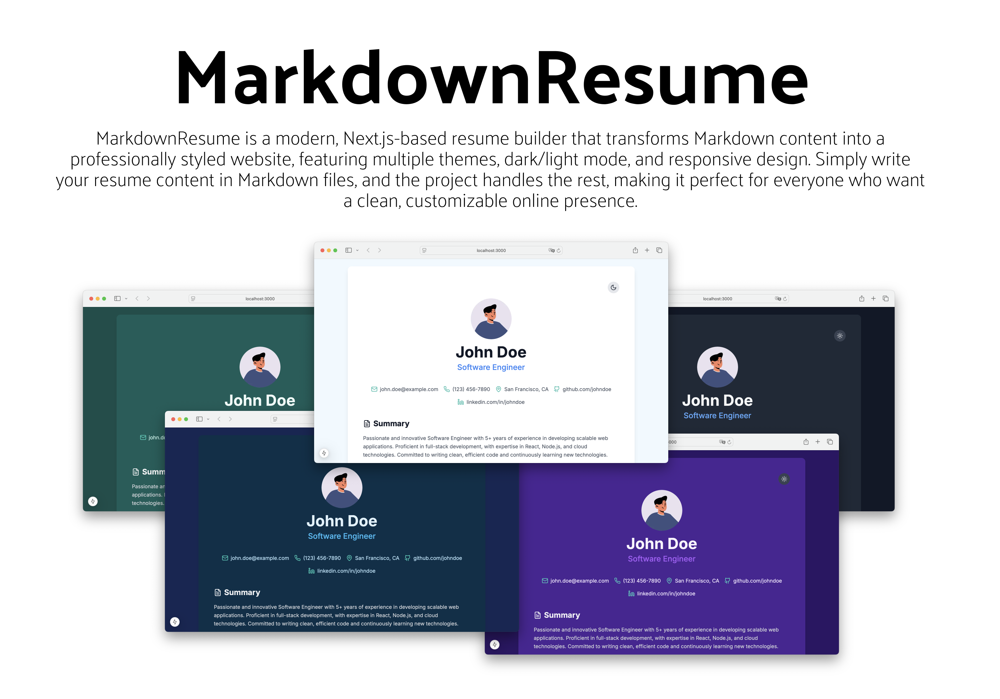

# MarkdownResume

MarkdownResume is a modern, hassle-free solution for creating your professional online resume. Simply write your content in Markdown format, and the project will generate a beautifully designed, responsive website with built-in dark/light mode support, multiple color themes, and sharing capabilities.


## Features

- 🎨 **Multiple Theme Options**: Choose from 7 pre-built color themes (Default, Blue, Purple, Green, Rose, Amber, Teal)
- 🌗 **Dark/Light Mode**: Automatic theme switching with system preferences support
- 📱 **Fully Responsive**: Optimized for mobile, tablet, and desktop viewing
- 📝 **Markdown-Based**: All content is managed through simple Markdown files
- 🔄 **Real-time Updates**: Changes to content files are immediately reflected
- 🎯 **SEO Ready**: Built-in metadata management for better search engine visibility
- 📄 **Legal Compliance**: Integrated support for Legal Notice and Data Privacy Policy pages
- 🔗 **Share Options**: Comprehensive sharing functionality with link, QR code, email, and vCard options

## Content Structure

The resume content is organized in the `content/` directory with the following structure:

```
content/
├── personal-details.md    # Basic information and contact details
├── summary.md            # Professional summary/overview
├── skills.md            # Technical and professional skills
├── experience/          # Work experience entries
│   ├── 001-current-job.md
│   └── 002-previous-job.md
├── education/          # Educational background
│   └── 001-bachelor-computer-science.md
├── publications/       # Academic or professional publications
│   ├── 001-latest-paper.md
│   └── 002-conference-paper.md
├── legalnotice.md     # Optional legal notice page
└── dataprivacypolicy.md # Optional data privacy policy page
```

## Setup Guide

### 1. Installation

#### Prerequisites
- Node.js 18.x or higher
- npm 9.x or higher
- Git

#### Basic Setup

```bash
# Fork the repository
# Visit https://github.com/seeschweiler/MarkdownResume
# Click the 'Fork' button in the top right
# Follow the instructions to create a fork in your account

# Clone your forked repository
git clone https://github.com/YOUR-USERNAME/MarkdownResume
cd markdown-resume

# Install dependencies using npm
npm install

# Create required environment file
echo "NEXT_PUBLIC_BASE_URL=http://localhost:3000" > .env.local
```

#### Required Directory Structure

Create the following files in your content directory:

```
content/
├── personal-details.md    # Required: Basic information
├── summary.md             # Required: Professional summary
├── skills.md            # Required: Technical skills
├── experience/          # Required: Work experience entries
│   ├── 001-current-job.md
│   └── 002-previous-job.md
├── education/           # Required: Educational background
│   └── 001-bachelor-computer-science.md
├── publications/        # Required: Academic or professional publications
│   ├── 001-latest-paper.md
│   └── 002-conference-paper.md
├── legalnotice.md       # Optional: Legal notice
└── dataprivacypolicy.md # Optional: Privacy policy
```

#### Development Mode

```bash
# Start the development server with Turbopack
npm run dev
```
Visit `http://localhost:3000` to see your resume.

#### Production Build

```bash
# Create production build
npm run build

# Start production server
npm start
```

### 2. Content Configuration

All content is managed through markdown files in the `content` directory. Each section of your resume is represented by specific markdown files with YAML frontmatter.

#### Personal Details (personal-details.md)
```markdown
---
name: "Your Name"
role: "Your Professional Title"
contact:
  email: "your.email@example.com"
  phone: "123-456-7890"
location: "City, Country"
social:
  github: "github.com/username"
  linkedin: "linkedin.com/in/username"
avatar: "/profile_avatar.png"  # Used for profile display and vCard contact photo
---
```

#### Experience Entries (experience/*.md)
Example: `content/experience/001-current-job.md`:
```markdown
---
title: "Senior Software Engineer"
company: "Company Name"
startDate: "2023-01"  # YYYY-MM format
endDate: "Present"    # or YYYY-MM format
---

- Key responsibility
- Major achievement
- Notable project
```

#### Education Entries (education/*.md)
Example: `content/education/001-bachelor-computer-science.md`:
```markdown
---
title: "Bachelor of Science in Computer Science"
institution: "University Name"
startDate: "2019-09"  # YYYY-MM format
endDate: "2023-06"    # YYYY-MM format or "Present"
---

Details about your education, such as:
- Major areas of study
- Notable achievements
- Relevant coursework
- Academic honors or awards
- Special projects or research
```

Each education entry will be displayed in chronological order, with the most recent education appearing first. The content section supports markdown formatting, allowing you to include lists, links, and other formatted text.

#### Skills (skills.md)
The `skills.md` file in the `content/` directory allows you to organize your skills into logical categories (e.g., Programming Languages, Frontend Development, Languages, etc.). Each category can contain multiple skills, providing a clear structure to your skillset.

Example `content/skills.md`:
```markdown
---
skillCategories:
  - category: Programming Languages
    skills:
      - TypeScript
      - JavaScript
      - SQL
  - category: Frontend Development
    skills:
      - React
      - HTML/CSS
  - category: Backend Development
    skills:
      - Node.js
      - Express
      - MongoDB
  - category: DevOps & Tools
    skills:
      - AWS
      - Docker
      - Git
---
```

The skills can be displayed in two different modes:

1. **Categorized Display** (default): Skills are grouped and displayed under their respective category headings.

*Skills displayed with categories enabled*

2. **Flat List Display**: All skills are shown in a single list without category headers.

*Skills displayed without categories*

You can switch between these display modes by configuring the `displaySkillCategories` setting in `site.config.ts`:
```typescript
const siteConfig = {
  displaySkillCategories: true,  // Set to false for flat list display
  // ... other config options
};
```

#### Publications (publications/*.md)
The `publications/` directory in the `content/` folder allows you to showcase your academic papers, professional publications, or other written works. Each publication is represented by a separate markdown file.

Example: `content/publications/001-latest-paper.md`:
```markdown
---
title: "Your Publication Title"
authors: "Your Name, Co-Author Name"
venue: "Journal or Conference Name"
date: "2023-12"    # YYYY-MM format
---

Description of the publication, key findings, or abstract. You can include:
- Research objectives
- Methodology highlights
- Key findings
- Impact or citations
- Links to full paper or DOI
```

The publications will be displayed in chronological order, with the most recent publications appearing first. All frontmatter fields (authors, venue, date) are optional - if a field is omitted, it will be skipped in the display without showing empty separators.

To configure the Publications section headline, update `site.config.ts`:
```typescript
const siteConfig = {
  texts: {
    publicationSectionHeadlineText: "Publications",  // Customize section headline
    // ... other config options
  }
};
```

### 3. Theme Configuration

Edit `config/site.config.ts` to configure your theme preferences:

```typescript
const siteConfig = {
  activeTheme: "default", // Choose your default theme
  displayThemeSelector: true, // Enable/disable theme selector in UI
  displayShareDialog: true, // Enable/disable share dialog
  displayStatement: true, // Enable/disable personal statement
  texts: {
    // Section headings customization
    summarySectionHeadlineText: "Summary",
    experienceSectionHeadlineText: "Experience",
    skillsSectionHeadlineText: "Skills",
    educationSectionHeadlineText: "Education",
    statementText: "Your personal statement or motto",
    // Share dialog texts
    shareDialogHeadlineText: "Share Resume",
    shareDialogEmailSubject: "Check out this resume",
    shareDialogEmailBody: "I thought you might be interested in this resume:",
  }
};
```

### 4. Share Configuration

The application includes a comprehensive sharing system that allows visitors to easily share the resume through various methods.


#### Share Dialog Features

The share dialog provides four sharing methods:

1. **Link Sharing**:
   - Displays the current URL
   - One-click copy to clipboard
   - Visual confirmation when copied

2. **QR Code**:
   - Generates a QR code for the current URL
   - Copy QR code as image
   - Perfect for mobile access

3. **Email Sharing**:
   - Opens default email client
   - Pre-filled subject and body
   - Customizable message template

4. **vCard Download**:
   - Download contact information as a virtual business card
   - Compatible with most contact management systems
   - Includes name, email, phone, website, and profile avatar
   - Profile picture automatically syncs with contact applications

To configure the share dialog, update `site.config.ts`:

```typescript
const siteConfig = {
  displayShareDialog: true,  // Enable/disable the main share dialog
  displayShareDialogTabLink: true,  // Enable/disable link sharing tab
  displayShareDialogEmailLink: true,  // Enable/disable email sharing tab
  displayShareDialogQRCodeLink: true,  // Enable/disable QR code tab
  displayShareDialogDownloadLink: true,  // Enable/disable vCard download tab
  texts: {
    shareDialogHeadlineText: "Share Resume",
    shareDialogEmailSubject: "Check out this resume",
    shareDialogEmailBody: "I thought you might be interested in this resume:",
    shareDialogLinkTabText: "Copy the direct link to share this resume with others",
    shareDialogQRCodeTabText: "Scan or copy the QR code to open this resume on a mobile device",
    shareDialogEmailTabText: "Send this resume directly via email",
    shareDialogVCardTabText: "Download contact information as a virtual business card (vCard)"
  }
};
```

### 5. SEO Configuration

The `site.config.ts` file provides extensive SEO customization options:

```typescript
const siteConfig = {
  texts: {
    // SEO Metadata
    metadataFallbackName: "Professional Resume",
    metadataFallbackRole: "Professional Profile",
    metadataDescriptionPrefix: "Professional resume",
    metadataDescriptionSuffix: "View professional experience, skills, and education",
    metadataKeywords: [
      "resume",
      "curriculum vitae",
      "cv",
      "professional experience",
      "skills",
    ],
  }
};
```

## Environment Variables

Create `.env.local`:

```env
NEXT_PUBLIC_BASE_URL=http://localhost:3000
```

## Deployment

### Vercel Deployment (Recommended)

1. Push your repository to GitHub
2. Visit [Vercel](https://vercel.com) and import your repository
3. Set up environment variables:
```bash
NEXT_PUBLIC_BASE_URL=https://your-domain.com  # Replace with your actual domain
```

### Alternative Deployment Options

#### Self-hosted Deployment

1. Build the application:
```bash
npm run build
npm start
```

2. Set up environment variables:
```bash
# .env.production
NEXT_PUBLIC_BASE_URL=https://your-domain.com
```

## License

This project is licensed under the MIT License - see the [LICENSE](LICENSE) file for details.

---

⭐️ If this project helps you create your perfect resume, please consider giving it a star on GitHub!